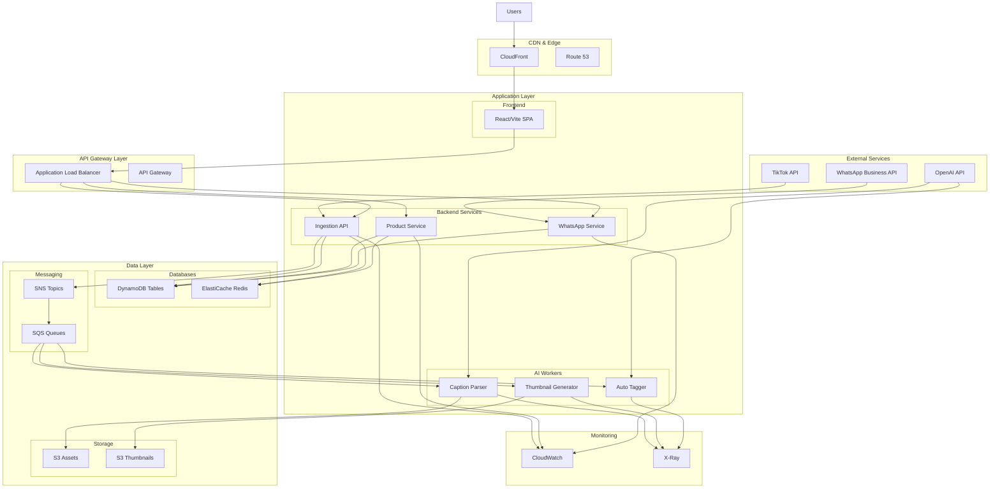
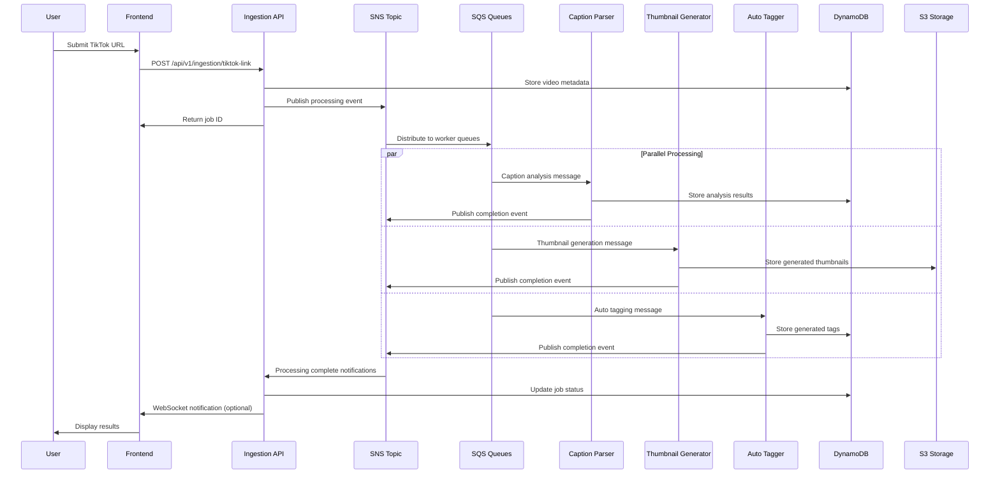
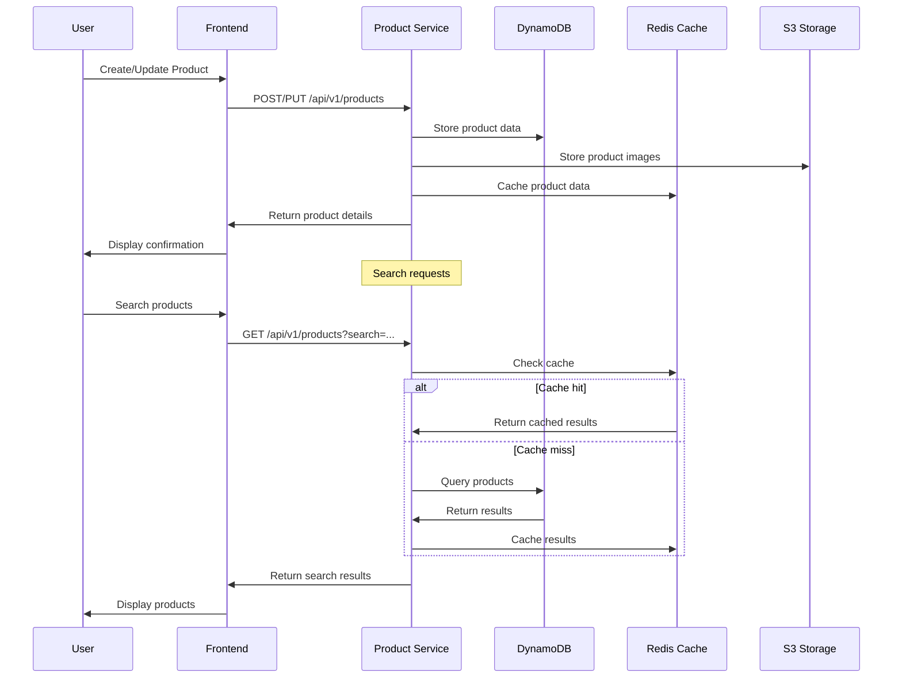

# System Architecture Documentation

This document provides a comprehensive overview of the TikTok Commerce Link Hub system architecture, including design principles, component interactions, and scalability considerations.

## 📋 Table of Contents

- [Architecture Overview](#architecture-overview)
- [Design Principles](#design-principles)
- [System Components](#system-components)
- [Data Flow](#data-flow)
- [Integration Patterns](#integration-patterns)
- [Scalability & Performance](#scalability--performance)
- [Security Architecture](#security-architecture)
- [Monitoring & Observability](#monitoring--observability)

## 🏗️ Architecture Overview

### High-Level Architecture



### Architecture Layers

#### 1. Presentation Layer
- **Frontend**: React SPA with Vite build system
- **CDN**: CloudFront for global content delivery
- **DNS**: Route 53 for domain management

#### 2. API Gateway Layer
- **Load Balancer**: Application Load Balancer for traffic distribution
- **API Gateway**: Optional for additional API management features
- **WAF**: Web Application Firewall for security

#### 3. Application Layer
- **Microservices**: Independent NestJS services
- **AI Workers**: Python-based Lambda functions
- **Container Orchestration**: ECS Fargate for service management

#### 4. Data Layer
- **NoSQL Database**: DynamoDB for scalable data storage
- **Cache**: ElastiCache Redis for performance optimization
- **Object Storage**: S3 for file and media storage
- **Message Queues**: SNS/SQS for asynchronous processing

#### 5. Infrastructure Layer
- **Compute**: ECS Fargate and AWS Lambda
- **Networking**: VPC with public/private subnets
- **Security**: IAM roles, Security Groups, Secrets Manager

## 🎯 Design Principles

### 1. Event-Driven Architecture
- **Loose Coupling**: Services communicate via events
- **Scalability**: Independent scaling of components
- **Resilience**: Failure isolation and recovery

### 2. Microservices Pattern
- **Single Responsibility**: Each service has a focused purpose
- **Independent Deployment**: Services can be deployed separately
- **Technology Diversity**: Best tool for each job

### 3. Cloud-Native Design
- **Serverless First**: Use managed services when possible
- **Auto-Scaling**: Automatic resource adjustment
- **Pay-per-Use**: Cost optimization through usage-based pricing

### 4. Security by Design
- **Zero Trust**: Verify every request
- **Least Privilege**: Minimal required permissions
- **Defense in Depth**: Multiple security layers

### 5. Observability
- **Comprehensive Logging**: Structured logging across all components
- **Metrics Collection**: Performance and business metrics
- **Distributed Tracing**: End-to-end request tracking

## 🔧 System Components

### Frontend Components

#### React Application
```typescript
// Component architecture
src/
├── components/          # Reusable UI components
│   ├── ui/             # shadcn/ui components
│   ├── forms/          # Form components
│   └── layout/         # Layout components
├── pages/              # Page components
├── hooks/              # Custom React hooks
├── services/           # API service layer
├── stores/             # State management
└── utils/              # Utility functions
```

**Key Features:**
- **Component Library**: shadcn/ui for consistent design
- **State Management**: React Query for server state
- **Routing**: React Router for navigation
- **Build System**: Vite for fast development and building

### Backend Services

#### Ingestion API
**Purpose**: Process TikTok links and initiate AI workflows

```typescript
// Service structure
src/
├── ingestion/          # Core ingestion logic
│   ├── dto/           # Data transfer objects
│   ├── services/      # Business logic
│   └── controllers/   # HTTP endpoints
├── common/            # Shared utilities
├── config/            # Configuration management
└── health/            # Health check endpoints
```

**Responsibilities:**
- TikTok URL validation and processing
- Video metadata extraction
- AI processing workflow initiation
- Job status tracking

#### Product Service
**Purpose**: Manage product catalog and commerce data

```typescript
// Service structure
src/
├── products/          # Product management
├── catalog/           # Catalog operations
├── search/            # Search functionality
└── analytics/         # Product analytics
```

**Responsibilities:**
- Product CRUD operations
- Catalog management
- Search and filtering
- Product analytics

#### WhatsApp Service
**Purpose**: Handle WhatsApp Business API integration

```typescript
// Service structure
src/
├── webhooks/          # WhatsApp webhook handlers
├── messaging/         # Message sending logic
├── templates/         # Message templates
└── contacts/          # Contact management
```

**Responsibilities:**
- WhatsApp webhook processing
- Message template management
- Contact synchronization
- Conversation handling

### AI Workers

#### Caption Parser
**Purpose**: Analyze TikTok video captions for commerce insights

```python
# Worker structure
main.py                # Lambda handler
services/
├── nlp_processor.py   # Natural language processing
├── product_extractor.py  # Product mention extraction
├── sentiment_analyzer.py # Sentiment analysis
└── price_detector.py  # Price information detection
```

**Capabilities:**
- Product mention detection
- Price information extraction
- Sentiment analysis
- Call-to-action identification

#### Thumbnail Generator
**Purpose**: Create optimized product thumbnails

```python
# Worker structure
main.py                # Lambda handler
services/
├── image_processor.py # Image manipulation
├── thumbnail_creator.py # Thumbnail generation
├── overlay_manager.py # Product overlay creation
└── optimizer.py       # Image optimization
```

**Capabilities:**
- Multiple thumbnail sizes
- Product overlay generation
- Image optimization
- Format conversion

#### Auto Tagger
**Purpose**: Generate relevant tags and categories

```python
# Worker structure
main.py                # Lambda handler
services/
├── tag_generator.py   # Tag generation logic
├── category_classifier.py # Category classification
├── trend_analyzer.py  # Trend analysis
└── seo_optimizer.py   # SEO optimization
```

**Capabilities:**
- AI-powered tag generation
- Category classification
- Trend analysis
- SEO keyword optimization

## 🔄 Data Flow

### TikTok Link Processing Flow



### Product Management Flow



## 🔗 Integration Patterns

### Event-Driven Integration

#### Publisher-Subscriber Pattern
```typescript
// Event publishing
export class EventPublisher {
  async publishEvent(eventType: string, data: any) {
    const message = {
      type: eventType,
      data,
      timestamp: new Date().toISOString(),
      correlationId: uuidv4()
    };
    
    await this.snsClient.publish({
      TopicArn: this.topicArn,
      Message: JSON.stringify(message),
      MessageAttributes: {
        eventType: {
          DataType: 'String',
          StringValue: eventType
        }
      }
    }).promise();
  }
}
```

#### Message Queue Processing
```python
# Lambda event handler
def lambda_handler(event, context):
    for record in event['Records']:
        try:
            message = json.loads(record['body'])
            process_message(message)
        except Exception as e:
            logger.error(f"Error processing message: {e}")
            # Message will be sent to DLQ after max retries
            raise
```

### API Integration Patterns

#### Circuit Breaker Pattern
```typescript
export class CircuitBreaker {
  private failures = 0;
  private lastFailureTime = 0;
  private state: 'CLOSED' | 'OPEN' | 'HALF_OPEN' = 'CLOSED';
  
  async call<T>(fn: () => Promise<T>): Promise<T> {
    if (this.state === 'OPEN') {
      if (Date.now() - this.lastFailureTime > this.timeout) {
        this.state = 'HALF_OPEN';
      } else {
        throw new Error('Circuit breaker is OPEN');
      }
    }
    
    try {
      const result = await fn();
      this.onSuccess();
      return result;
    } catch (error) {
      this.onFailure();
      throw error;
    }
  }
}
```

#### Retry Pattern with Exponential Backoff
```typescript
export class RetryHandler {
  async executeWithRetry<T>(
    fn: () => Promise<T>,
    maxRetries = 3,
    baseDelay = 1000
  ): Promise<T> {
    for (let attempt = 0; attempt <= maxRetries; attempt++) {
      try {
        return await fn();
      } catch (error) {
        if (attempt === maxRetries) throw error;
        
        const delay = baseDelay * Math.pow(2, attempt);
        await this.sleep(delay);
      }
    }
  }
}
```

## 📈 Scalability & Performance

### Horizontal Scaling

#### Auto Scaling Configuration
```hcl
resource "aws_appautoscaling_target" "ecs_target" {
  max_capacity       = 20
  min_capacity       = 2
  resource_id        = "service/${aws_ecs_cluster.main.name}/${aws_ecs_service.app.name}"
  scalable_dimension = "ecs:service:DesiredCount"
  service_namespace  = "ecs"
}

resource "aws_appautoscaling_policy" "scale_up" {
  name               = "scale-up"
  policy_type        = "TargetTrackingScaling"
  resource_id        = aws_appautoscaling_target.ecs_target.resource_id
  scalable_dimension = aws_appautoscaling_target.ecs_target.scalable_dimension
  service_namespace  = aws_appautoscaling_target.ecs_target.service_namespace

  target_tracking_scaling_policy_configuration {
    predefined_metric_specification {
      predefined_metric_type = "ECSServiceAverageCPUUtilization"
    }
    target_value       = 70.0
    scale_in_cooldown  = 300
    scale_out_cooldown = 300
  }
}
```

### Caching Strategy

#### Multi-Level Caching
```typescript
export class CacheService {
  // L1: In-memory cache
  private memoryCache = new Map<string, any>();
  
  // L2: Redis cache
  private redisClient: Redis;
  
  async get<T>(key: string): Promise<T | null> {
    // Check L1 cache
    if (this.memoryCache.has(key)) {
      return this.memoryCache.get(key);
    }
    
    // Check L2 cache
    const redisValue = await this.redisClient.get(key);
    if (redisValue) {
      const parsed = JSON.parse(redisValue);
      this.memoryCache.set(key, parsed);
      return parsed;
    }
    
    return null;
  }
  
  async set<T>(key: string, value: T, ttl = 3600): Promise<void> {
    // Set in both caches
    this.memoryCache.set(key, value);
    await this.redisClient.setex(key, ttl, JSON.stringify(value));
  }
}
```

### Database Optimization

#### DynamoDB Best Practices
```typescript
// Efficient query patterns
export class ProductRepository {
  async getProductsByCategory(category: string, limit = 20): Promise<Product[]> {
    const params = {
      TableName: this.tableName,
      IndexName: 'CategoryIndex',
      KeyConditionExpression: 'category = :category',
      ExpressionAttributeValues: {
        ':category': category
      },
      Limit: limit,
      ScanIndexForward: false // Most recent first
    };
    
    const result = await this.dynamoClient.query(params).promise();
    return result.Items as Product[];
  }
  
  // Batch operations for efficiency
  async batchGetProducts(productIds: string[]): Promise<Product[]> {
    const chunks = this.chunkArray(productIds, 100); // DynamoDB limit
    const results = [];
    
    for (const chunk of chunks) {
      const params = {
        RequestItems: {
          [this.tableName]: {
            Keys: chunk.map(id => ({ id }))
          }
        }
      };
      
      const result = await this.dynamoClient.batchGet(params).promise();
      results.push(...result.Responses[this.tableName]);
    }
    
    return results as Product[];
  }
}
```

## 🔒 Security Architecture

### Authentication & Authorization

#### JWT Token Validation
```typescript
@Injectable()
export class AuthGuard implements CanActivate {
  async canActivate(context: ExecutionContext): Promise<boolean> {
    const request = context.switchToHttp().getRequest();
    const token = this.extractTokenFromHeader(request);
    
    if (!token) {
      throw new UnauthorizedException();
    }
    
    try {
      const payload = await this.jwtService.verifyAsync(token, {
        secret: this.configService.get('JWT_SECRET')
      });
      
      request['user'] = payload;
      return true;
    } catch {
      throw new UnauthorizedException();
    }
  }
}
```

#### IAM Role-Based Access
```hcl
resource "aws_iam_role" "ecs_task_role" {
  name = "tiktok-commerce-ecs-task-role"

  assume_role_policy = jsonencode({
    Version = "2012-10-17"
    Statement = [
      {
        Action = "sts:AssumeRole"
        Effect = "Allow"
        Principal = {
          Service = "ecs-tasks.amazonaws.com"
        }
      }
    ]
  })
}

resource "aws_iam_role_policy" "ecs_task_policy" {
  name = "tiktok-commerce-ecs-task-policy"
  role = aws_iam_role.ecs_task_role.id

  policy = jsonencode({
    Version = "2012-10-17"
    Statement = [
      {
        Effect = "Allow"
        Action = [
          "dynamodb:GetItem",
          "dynamodb:PutItem",
          "dynamodb:UpdateItem",
          "dynamodb:Query"
        ]
        Resource = [
          aws_dynamodb_table.products.arn,
          "${aws_dynamodb_table.products.arn}/index/*"
        ]
      }
    ]
  })
}
```

### Data Protection

#### Encryption at Rest and in Transit
```typescript
// S3 encryption configuration
const s3Client = new S3({
  region: 'us-east-1',
  sslEnabled: true,
  s3ForcePathStyle: false,
  signatureVersion: 'v4'
});

// Upload with server-side encryption
await s3Client.putObject({
  Bucket: bucketName,
  Key: objectKey,
  Body: fileBuffer,
  ServerSideEncryption: 'AES256',
  ContentType: 'image/jpeg'
}).promise();
```

## 📊 Monitoring & Observability

### Distributed Tracing
```typescript
import { trace, context } from '@opentelemetry/api';

export class TracingService {
  private tracer = trace.getTracer('tiktok-commerce');
  
  async traceOperation<T>(
    operationName: string,
    operation: () => Promise<T>
  ): Promise<T> {
    const span = this.tracer.startSpan(operationName);
    
    try {
      const result = await context.with(trace.setSpan(context.active(), span), operation);
      span.setStatus({ code: trace.SpanStatusCode.OK });
      return result;
    } catch (error) {
      span.setStatus({
        code: trace.SpanStatusCode.ERROR,
        message: error.message
      });
      throw error;
    } finally {
      span.end();
    }
  }
}
```

### Custom Metrics
```typescript
export class MetricsService {
  private cloudWatch = new CloudWatch();
  
  async putMetric(metricName: string, value: number, unit = 'Count'): Promise<void> {
    await this.cloudWatch.putMetricData({
      Namespace: 'TikTokCommerce',
      MetricData: [{
        MetricName: metricName,
        Value: value,
        Unit: unit,
        Timestamp: new Date()
      }]
    }).promise();
  }
  
  async recordProcessingTime(operation: string, duration: number): Promise<void> {
    await this.putMetric(`${operation}.Duration`, duration, 'Milliseconds');
  }
}
```

---

This completes the comprehensive architecture documentation. The system is designed for scalability, reliability, and maintainability while following cloud-native best practices.
