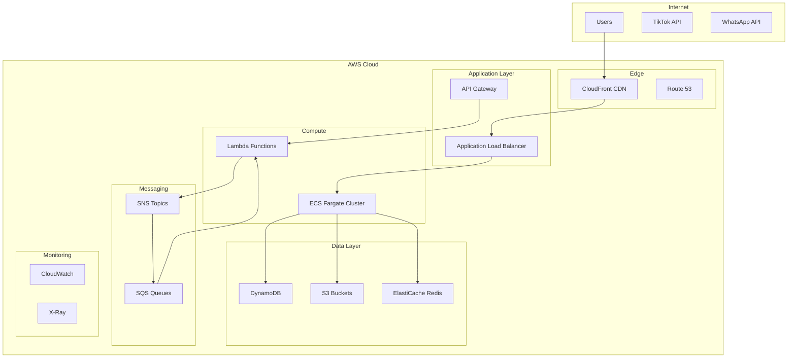

# AWS Production Deployment Guide

This document covers the complete AWS production deployment process for the TikTok Commerce Link Hub, including infrastructure setup, service deployment, and operational procedures.

## 📋 Table of Contents

- [Architecture Overview](#architecture-overview)
- [Prerequisites](#prerequisites)
- [Infrastructure Components](#infrastructure-components)
- [Deployment Process](#deployment-process)
- [Service Configuration](#service-configuration)
- [Monitoring & Observability](#monitoring--observability)
- [Security Configuration](#security-configuration)
- [Scaling & Performance](#scaling--performance)
- [Disaster Recovery](#disaster-recovery)
- [Cost Optimization](#cost-optimization)

## 🏗️ Architecture Overview

### Production Architecture Diagram



### Service Architecture

#### Frontend (React/Vite)
- **Hosting**: S3 + CloudFront
- **Domain**: Custom domain with SSL certificate
- **CDN**: Global edge locations for performance

#### Backend Services (NestJS)
- **Compute**: ECS Fargate containers
- **Load Balancing**: Application Load Balancer
- **Auto Scaling**: CPU and memory-based scaling
- **Health Checks**: Application and infrastructure level

#### AI Workers (Python)
- **Compute**: AWS Lambda functions
- **Triggers**: SQS queue messages
- **Scaling**: Automatic based on queue depth
- **Timeout**: Configured per worker type

## 🔧 Prerequisites

### AWS Account Setup
1. **AWS Account**: Production-ready AWS account
2. **IAM Roles**: Proper permissions for deployment
3. **Domain**: Registered domain for the application
4. **SSL Certificate**: ACM certificate for HTTPS

### Required Tools
```bash
# Install AWS CLI
curl "https://awscli.amazonaws.com/awscli-exe-linux-x86_64.zip" -o "awscliv2.zip"
unzip awscliv2.zip
sudo ./aws/install

# Install Terraform
wget https://releases.hashicorp.com/terraform/1.5.0/terraform_1.5.0_linux_amd64.zip
unzip terraform_1.5.0_linux_amd64.zip
sudo mv terraform /usr/local/bin/

# Install Docker
sudo apt-get update
sudo apt-get install docker.io docker-compose
```

### Environment Configuration
```bash
# Configure AWS credentials
aws configure
# AWS Access Key ID: [Your Access Key]
# AWS Secret Access Key: [Your Secret Key]
# Default region name: us-east-1
# Default output format: json

# Verify configuration
aws sts get-caller-identity
```

## 🏗️ Infrastructure Components

### Core Infrastructure

#### 1. Networking (VPC)
```hcl
# VPC with public and private subnets
resource "aws_vpc" "main" {
  cidr_block           = "10.0.0.0/16"
  enable_dns_hostnames = true
  enable_dns_support   = true
}

# Public subnets for load balancers
resource "aws_subnet" "public" {
  count             = 2
  vpc_id            = aws_vpc.main.id
  cidr_block        = "10.0.${count.index + 1}.0/24"
  availability_zone = data.aws_availability_zones.available.names[count.index]
}

# Private subnets for applications
resource "aws_subnet" "private" {
  count             = 2
  vpc_id            = aws_vpc.main.id
  cidr_block        = "10.0.${count.index + 10}.0/24"
  availability_zone = data.aws_availability_zones.available.names[count.index]
}
```

#### 2. Storage Layer

**DynamoDB Tables**
- **Videos Table**: TikTok video metadata and processing status
- **Products Table**: Product catalog with search indexes
- **Jobs Table**: Processing job tracking and status
- **Users Table**: User accounts and preferences
- **Analytics Table**: Usage metrics and insights

**S3 Buckets**
- **Assets Bucket**: Product images and media files
- **Thumbnails Bucket**: Generated thumbnail images
- **Logs Bucket**: Application and access logs
- **Backup Bucket**: Database backups and exports

#### 3. Compute Layer

**ECS Fargate Cluster**
```hcl
resource "aws_ecs_cluster" "main" {
  name = "${var.project_name}-${var.environment}"
  
  setting {
    name  = "containerInsights"
    value = "enabled"
  }
}

# Task definitions for each service
resource "aws_ecs_task_definition" "ingestion_api" {
  family                   = "${var.project_name}-ingestion-api"
  network_mode             = "awsvpc"
  requires_compatibilities = ["FARGATE"]
  cpu                      = 256
  memory                   = 512
  execution_role_arn       = aws_iam_role.ecs_execution_role.arn
  task_role_arn           = aws_iam_role.ecs_task_role.arn
}
```

**Lambda Functions**
```hcl
resource "aws_lambda_function" "caption_parser" {
  filename         = "caption-parser.zip"
  function_name    = "${var.project_name}-caption-parser"
  role            = aws_iam_role.lambda_execution_role.arn
  handler         = "main.lambda_handler"
  runtime         = "python3.11"
  timeout         = 300
  memory_size     = 1024
  
  environment {
    variables = {
      SNS_TOPIC_ARN = aws_sns_topic.processing.arn
      S3_BUCKET     = aws_s3_bucket.assets.bucket
    }
  }
}
```

#### 4. Messaging Layer

**SNS Topics**
- **Processing Topic**: Coordinates AI worker processing
- **Notifications Topic**: User and system notifications
- **Alerts Topic**: System alerts and monitoring

**SQS Queues**
- **Caption Analysis Queue**: Video caption processing
- **Thumbnail Generation Queue**: Image processing
- **Auto Tagging Queue**: Content tagging
- **Dead Letter Queues**: Failed message handling

## 🚀 Deployment Process

### 1. Infrastructure Deployment

#### Initialize Terraform
```bash
cd infra/terraform

# Initialize Terraform
terraform init

# Create workspace for environment
terraform workspace new production
terraform workspace select production
```

#### Plan Infrastructure
```bash
# Review planned changes
terraform plan -var-file=production.tfvars -out=tfplan

# Review the plan output carefully
terraform show tfplan
```

#### Apply Infrastructure
```bash
# Apply infrastructure changes
terraform apply tfplan

# Verify deployment
terraform output
```

### 2. Application Deployment

#### Build and Push Docker Images
```bash
# Build all service images
npm run docker:build

# Tag for ECR
docker tag tiktok-commerce-ingestion-api:latest \
  123456789012.dkr.ecr.us-east-1.amazonaws.com/tiktok-commerce-ingestion-api:latest

# Push to ECR
aws ecr get-login-password --region us-east-1 | \
  docker login --username AWS --password-stdin \
  123456789012.dkr.ecr.us-east-1.amazonaws.com

docker push 123456789012.dkr.ecr.us-east-1.amazonaws.com/tiktok-commerce-ingestion-api:latest
```

#### Deploy Services
```bash
# Update ECS services
aws ecs update-service \
  --cluster tiktok-commerce-production \
  --service ingestion-api \
  --force-new-deployment

# Deploy Lambda functions
aws lambda update-function-code \
  --function-name tiktok-commerce-caption-parser \
  --image-uri 123456789012.dkr.ecr.us-east-1.amazonaws.com/caption-parser:latest
```

#### Deploy Frontend
```bash
# Build frontend
npm run build:frontend

# Sync to S3
aws s3 sync apps/frontend/dist/ s3://tiktok-commerce-frontend-prod --delete

# Invalidate CloudFront cache
aws cloudfront create-invalidation \
  --distribution-id E1234567890123 \
  --paths "/*"
```

### 3. Database Setup

#### Initialize DynamoDB Tables
```bash
# Tables are created by Terraform, but you may need to seed data
aws dynamodb put-item \
  --table-name tiktok-commerce-products-prod \
  --item file://seed-data/sample-product.json
```

#### Set up ElastiCache
```bash
# Redis cluster is created by Terraform
# Verify connectivity
redis-cli -h tiktok-commerce-redis-prod.abc123.cache.amazonaws.com -p 6379 ping
```

## ⚙️ Service Configuration

### Environment Variables

#### Ingestion API
```bash
NODE_ENV=production
PORT=3001
AWS_REGION=us-east-1
DYNAMODB_VIDEOS_TABLE=tiktok-commerce-videos-prod
DYNAMODB_JOBS_TABLE=tiktok-commerce-jobs-prod
SNS_TOPIC_ARN=arn:aws:sns:us-east-1:123456789012:tiktok-processing-prod
REDIS_HOST=tiktok-commerce-redis-prod.abc123.cache.amazonaws.com
```

#### Product Service
```bash
NODE_ENV=production
PORT=3002
AWS_REGION=us-east-1
DYNAMODB_PRODUCTS_TABLE=tiktok-commerce-products-prod
S3_BUCKET=tiktok-commerce-assets-prod
REDIS_HOST=tiktok-commerce-redis-prod.abc123.cache.amazonaws.com
```

#### AI Workers
```bash
SNS_TOPIC_ARN=arn:aws:sns:us-east-1:123456789012:tiktok-processing-prod
S3_BUCKET=tiktok-commerce-assets-prod
OPENAI_API_KEY=sk-...
CONFIDENCE_THRESHOLD=0.8
```

### Load Balancer Configuration

#### Application Load Balancer
```hcl
resource "aws_lb" "main" {
  name               = "${var.project_name}-alb"
  internal           = false
  load_balancer_type = "application"
  security_groups    = [aws_security_group.alb.id]
  subnets           = aws_subnet.public[*].id

  enable_deletion_protection = true
}

# Target groups for each service
resource "aws_lb_target_group" "ingestion_api" {
  name     = "${var.project_name}-ingestion-api"
  port     = 3001
  protocol = "HTTP"
  vpc_id   = aws_vpc.main.id
  target_type = "ip"

  health_check {
    enabled             = true
    healthy_threshold   = 2
    interval            = 30
    matcher             = "200"
    path                = "/health"
    port                = "traffic-port"
    protocol            = "HTTP"
    timeout             = 5
    unhealthy_threshold = 2
  }
}
```

### Auto Scaling Configuration

#### ECS Service Auto Scaling
```hcl
resource "aws_appautoscaling_target" "ecs_target" {
  max_capacity       = 10
  min_capacity       = 2
  resource_id        = "service/${aws_ecs_cluster.main.name}/${aws_ecs_service.ingestion_api.name}"
  scalable_dimension = "ecs:service:DesiredCount"
  service_namespace  = "ecs"
}

resource "aws_appautoscaling_policy" "ecs_policy_cpu" {
  name               = "cpu-scaling"
  policy_type        = "TargetTrackingScaling"
  resource_id        = aws_appautoscaling_target.ecs_target.resource_id
  scalable_dimension = aws_appautoscaling_target.ecs_target.scalable_dimension
  service_namespace  = aws_appautoscaling_target.ecs_target.service_namespace

  target_tracking_scaling_policy_configuration {
    predefined_metric_specification {
      predefined_metric_type = "ECSServiceAverageCPUUtilization"
    }
    target_value = 70.0
  }
}
```

## 📊 Monitoring & Observability

### CloudWatch Configuration

#### Log Groups
```hcl
resource "aws_cloudwatch_log_group" "ingestion_api" {
  name              = "/ecs/tiktok-commerce-ingestion-api"
  retention_in_days = 30
}

resource "aws_cloudwatch_log_group" "lambda_caption_parser" {
  name              = "/aws/lambda/tiktok-commerce-caption-parser"
  retention_in_days = 14
}
```

#### Metrics and Alarms
```hcl
resource "aws_cloudwatch_metric_alarm" "high_cpu" {
  alarm_name          = "tiktok-commerce-high-cpu"
  comparison_operator = "GreaterThanThreshold"
  evaluation_periods  = "2"
  metric_name         = "CPUUtilization"
  namespace           = "AWS/ECS"
  period              = "300"
  statistic           = "Average"
  threshold           = "80"
  alarm_description   = "This metric monitors ecs cpu utilization"
  alarm_actions       = [aws_sns_topic.alerts.arn]

  dimensions = {
    ServiceName = aws_ecs_service.ingestion_api.name
    ClusterName = aws_ecs_cluster.main.name
  }
}
```

### X-Ray Tracing
```hcl
resource "aws_xray_sampling_rule" "main" {
  rule_name      = "TikTokCommerceTracing"
  priority       = 9000
  version        = 1
  reservoir_size = 1
  fixed_rate     = 0.1
  url_path       = "*"
  host           = "*"
  http_method    = "*"
  service_type   = "*"
  service_name   = "*"
  resource_arn   = "*"
}
```

### Custom Dashboards
```hcl
resource "aws_cloudwatch_dashboard" "main" {
  dashboard_name = "TikTokCommerce-Production"

  dashboard_body = jsonencode({
    widgets = [
      {
        type   = "metric"
        x      = 0
        y      = 0
        width  = 12
        height = 6

        properties = {
          metrics = [
            ["AWS/ECS", "CPUUtilization", "ServiceName", aws_ecs_service.ingestion_api.name],
            [".", "MemoryUtilization", ".", "."],
          ]
          view    = "timeSeries"
          stacked = false
          region  = "us-east-1"
          title   = "ECS Service Metrics"
          period  = 300
        }
      }
    ]
  })
}
```

## 🔒 Security Configuration

### IAM Roles and Policies

#### ECS Task Role
```hcl
resource "aws_iam_role" "ecs_task_role" {
  name = "${var.project_name}-ecs-task-role"

  assume_role_policy = jsonencode({
    Version = "2012-10-17"
    Statement = [
      {
        Action = "sts:AssumeRole"
        Effect = "Allow"
        Principal = {
          Service = "ecs-tasks.amazonaws.com"
        }
      }
    ]
  })
}

resource "aws_iam_role_policy" "ecs_task_policy" {
  name = "${var.project_name}-ecs-task-policy"
  role = aws_iam_role.ecs_task_role.id

  policy = jsonencode({
    Version = "2012-10-17"
    Statement = [
      {
        Effect = "Allow"
        Action = [
          "dynamodb:GetItem",
          "dynamodb:PutItem",
          "dynamodb:UpdateItem",
          "dynamodb:DeleteItem",
          "dynamodb:Query",
          "dynamodb:Scan"
        ]
        Resource = [
          aws_dynamodb_table.videos.arn,
          aws_dynamodb_table.products.arn,
          aws_dynamodb_table.jobs.arn
        ]
      },
      {
        Effect = "Allow"
        Action = [
          "s3:GetObject",
          "s3:PutObject",
          "s3:DeleteObject"
        ]
        Resource = [
          "${aws_s3_bucket.assets.arn}/*",
          "${aws_s3_bucket.thumbnails.arn}/*"
        ]
      },
      {
        Effect = "Allow"
        Action = [
          "sns:Publish"
        ]
        Resource = aws_sns_topic.processing.arn
      }
    ]
  })
}
```

### Security Groups

#### ALB Security Group
```hcl
resource "aws_security_group" "alb" {
  name_prefix = "${var.project_name}-alb-"
  vpc_id      = aws_vpc.main.id

  ingress {
    from_port   = 80
    to_port     = 80
    protocol    = "tcp"
    cidr_blocks = ["0.0.0.0/0"]
  }

  ingress {
    from_port   = 443
    to_port     = 443
    protocol    = "tcp"
    cidr_blocks = ["0.0.0.0/0"]
  }

  egress {
    from_port   = 0
    to_port     = 0
    protocol    = "-1"
    cidr_blocks = ["0.0.0.0/0"]
  }
}
```

#### ECS Security Group
```hcl
resource "aws_security_group" "ecs" {
  name_prefix = "${var.project_name}-ecs-"
  vpc_id      = aws_vpc.main.id

  ingress {
    from_port       = 3001
    to_port         = 3003
    protocol        = "tcp"
    security_groups = [aws_security_group.alb.id]
  }

  egress {
    from_port   = 0
    to_port     = 0
    protocol    = "-1"
    cidr_blocks = ["0.0.0.0/0"]
  }
}
```

### Secrets Management
```hcl
resource "aws_secretsmanager_secret" "openai_api_key" {
  name = "${var.project_name}/openai-api-key"
}

resource "aws_secretsmanager_secret_version" "openai_api_key" {
  secret_id     = aws_secretsmanager_secret.openai_api_key.id
  secret_string = var.openai_api_key
}
```

---

**Next**: [Local Development Guide](../development/local-development.md)
