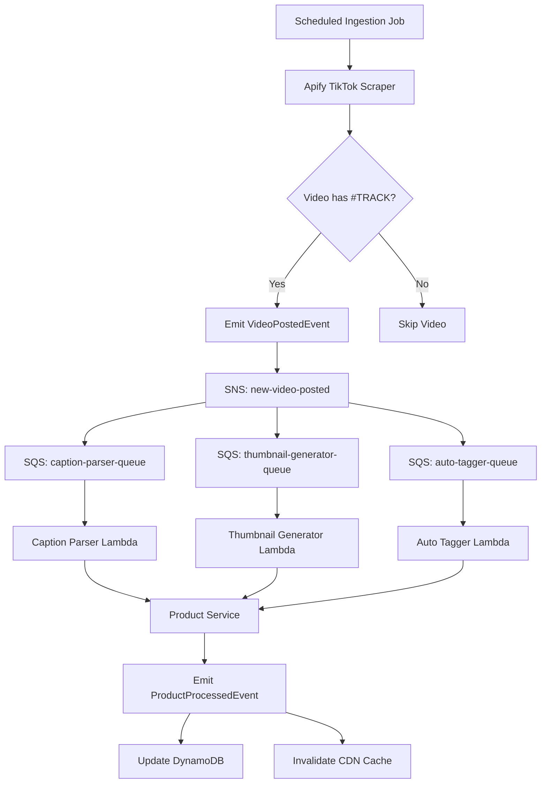

# Event Schemas for TikTok Commerce Platform

This document defines the event schemas used in the TikTok Commerce Link Hub ingestion pipeline.

## Overview

The platform uses an event-driven architecture with SNS/SQS for message passing between services. All events follow a consistent structure and are processed asynchronously.

## Core Events

### 1. VideoPostedEvent

**Topic**: `new-video-posted`  
**Trigger**: When a TikTok video containing `#TRACK` hashtag is detected during scheduled ingestion  
**Consumers**: `caption-parser`, `thumbnail-generator`, `auto-tagger`

```json
{
  "video_id": "abc123",
  "caption": "🔥 New heels only 55k! Sizes 37–41 #TRACK",
  "seller_handle": "nalu-fashion",
  "video_url": "https://tiktok.com/abc123",
  "timestamp": "2025-07-15T10:30:00Z",
  "metadata": {
    "likes_count": 1250,
    "comments_count": 45,
    "shares_count": 23,
    "duration": 15,
    "thumbnail_url": "https://tiktok.com/thumbnail/abc123.jpg"
  }
}
```

**Required Fields**:
- `video_id`: Unique TikTok video identifier
- `caption`: Full video caption text
- `seller_handle`: TikTok handle of the seller
- `video_url`: Direct URL to the TikTok video

**Optional Fields**:
- `timestamp`: ISO 8601 timestamp when event was created
- `metadata`: Additional video statistics and information

### 2. ProductProcessedEvent

**Topic**: `product-processed`  
**Trigger**: When all AI workers have completed processing a video  
**Consumers**: `product-service`, `shop-cache-invalidator`

```json
{
  "video_id": "abc123",
  "seller_handle": "nalu-fashion",
  "product_data": {
    "title": "Stylish High Heels",
    "description": "Beautiful heels available in sizes 37-41",
    "price": 55000,
    "currency": "UGX",
    "category": "footwear",
    "tags": ["heels", "shoes", "fashion", "women"],
    "thumbnail_url": "https://s3.amazonaws.com/thumbnails/abc123.jpg",
    "extracted_text": "New heels only 55k! Sizes 37–41"
  },
  "processing_results": {
    "caption_parser": {
      "status": "success",
      "result": {
        "price": 55000,
        "currency": "UGX",
        "sizes": ["37", "38", "39", "40", "41"],
        "product_type": "heels"
      }
    },
    "thumbnail_generator": {
      "status": "success",
      "result": {
        "thumbnail_url": "https://s3.amazonaws.com/thumbnails/abc123.jpg",
        "dominant_colors": ["#FF6B6B", "#4ECDC4"]
      }
    },
    "auto_tagger": {
      "status": "success",
      "result": {
        "tags": ["heels", "shoes", "fashion", "women"],
        "category": "footwear",
        "confidence": 0.95
      }
    }
  },
  "timestamp": "2025-07-15T10:35:00Z"
}
```

### 3. ShopLinkGeneratedEvent

**Topic**: `shop-link-generated`  
**Trigger**: When a user completes signup and shop link is created  
**Consumers**: `notification-service`, `analytics-service`

```json
{
  "handle": "nalu-fashion",
  "phone": "+256701234567",
  "shop_link": "/shop/nalu-fashion",
  "subscription_status": "trial",
  "created_at": "2025-07-15T09:00:00Z"
}
```

## Event Processing Flow



## Free Tier Optimizations

### Message Retention
- **SQS Queues**: 4 days (instead of default 14 days)
- **Dead Letter Queues**: 14 days for debugging

### Polling Configuration
- **Long Polling**: 20 seconds to reduce API calls
- **Visibility Timeout**: Matched to Lambda timeout + buffer

### Monitoring
- **CloudWatch Alarms**: Only for critical failures
- **Log Retention**: 14 days maximum

## Error Handling

### Dead Letter Queues
All SQS queues have associated DLQs with:
- **Max Receive Count**: 3 attempts
- **Retention**: 14 days for debugging

### Retry Strategy
1. **Immediate Retry**: Lambda automatic retry
2. **Exponential Backoff**: SQS visibility timeout
3. **Dead Letter**: After 3 failed attempts
4. **Manual Intervention**: DLQ monitoring and replay

## Implementation Notes

### TypeScript Interfaces
All event schemas are defined in `libs/common/src/interfaces/messaging.interface.ts`

### Validation
Events should be validated using JSON Schema or TypeScript interfaces before publishing

### Versioning
Events include optional `version` field for future schema evolution

### Correlation IDs
Use `correlationId` field to track related events across the pipeline
