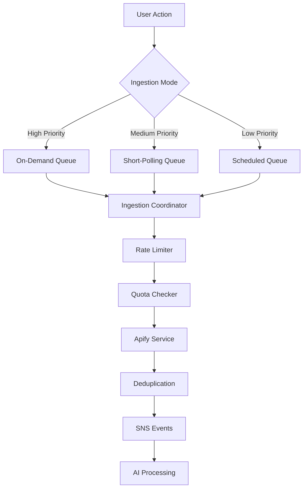
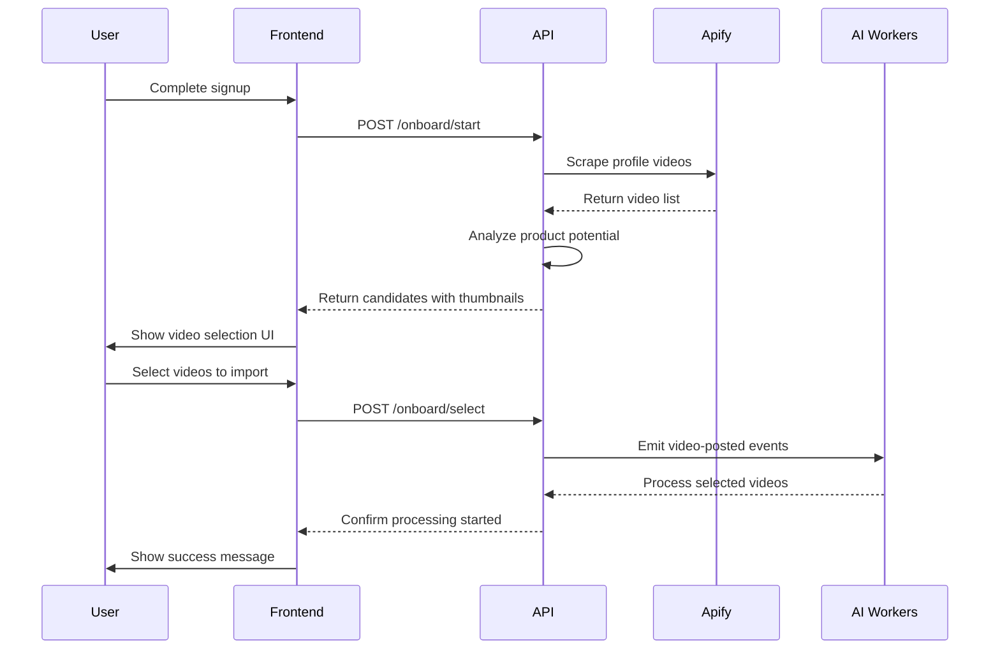

# Near-Instant Ingestion & Onboarding Design

## Executive Summary

This document outlines the implementation of a hybrid ingestion system that provides near-instant video processing (1-10 minutes) while maintaining cost-effectiveness, plus an onboarding flow for importing old videos with plan-based limits.

## Current State Analysis

### Existing System
- **Current Frequency**: 2 scheduled runs per day per seller
- **Apify Actor**: `clockworks/tiktok-profile-scraper`
- **Estimated Cost**: ~0.05 CU per run (~$0.02 USD / ~76 UGX)
- **Deduplication**: ✅ Already implemented via Products table check
- **Processing Pipeline**: Apify → SNS → AI Workers → Products

### Cost Analysis (Conservative Estimates)

Based on Apify pricing and community usage data:
- **1 CU = $0.4 USD** (Starter plan)
- **Estimated CU per run = 0.05** (conservative estimate for profile scraping)
- **Cost per run = $0.02 USD ≈ 76 UGX** (at 1 USD = 3,800 UGX)

## Hybrid Ingestion Architecture

### Three-Tier Ingestion System



### 1. On-Demand Ingestion (1-5 minutes)
**Trigger**: User clicks "Sync Now" button
**Priority**: High
**Rate Limit**: 10 requests/minute globally
**Use Case**: Immediate sync after posting new video

**Implementation**:
- REST endpoint: `POST /api/v1/ingestion/sync-now`
- Queue-based processing with priority
- Per-seller quota: 5 requests/month (free), 50 requests/month (paid)

### 2. Short-Polling (5-10 minutes)
**Trigger**: Automatic for paid/active sellers
**Priority**: Medium
**Frequency**: Every 5 minutes (configurable)
**Use Case**: Near-real-time sync for paying customers

**Implementation**:
- Background service polls high-priority sellers
- Token bucket algorithm for fair resource allocation
- Enabled automatically for paid plans

### 3. Scheduled Fallback (12-24 hours)
**Trigger**: Existing cron jobs
**Priority**: Low
**Frequency**: Twice daily
**Use Case**: Backup sync for all sellers

## Cost Management & Quotas

### Per-Seller Monthly Quotas

| Plan Type | Apify Runs | CU Allowance | On-Demand Requests | Estimated Cost |
|-----------|------------|--------------|-------------------|----------------|
| **Free Trial** | 10 | 0.5 | 5 | $0.20 (~760 UGX) |
| **Paid (10,000 UGX)** | 130 | 6.5 | 50 | $2.60 (~9,880 UGX) |

### Global Budget Controls
- **Monthly CU Cap**: 8,000 CU (~$3,200 USD)
- **Rate Limiting**: 10 on-demand requests/minute
- **Concurrent Runs**: Maximum 3 simultaneous Apify runs
- **Monitoring**: CloudWatch alerts at 80% usage

## Onboarding Flow for Old Videos

### Business Logic

**Free Trial Onboarding**:
- Scrape up to 50 latest videos (1 Apify run)
- User selects up to 10 videos for processing
- Cost: ~0.05 CU (~$0.02 / ~76 UGX)

**Paid Plan Onboarding**:
- Scrape up to 1,000 latest videos (~10 Apify runs)
- User selects up to 100 videos for processing
- Cost: ~0.5 CU (~$0.20 / ~760 UGX)

### User Experience Flow



### Product Detection Heuristics

The system analyzes video captions for product indicators:
- **Keywords**: selling, price, available, order, delivery, shop
- **Price Patterns**: "UGX 50,000", "50k", "Shs 1,000"
- **Contact Info**: WhatsApp, DM, phone numbers
- **Scoring**: Videos with multiple indicators ranked higher

## Implementation Details

### New Services

1. **IngestionCoordinatorService**
   - Manages three ingestion queues
   - Implements rate limiting and quota enforcement
   - Provides queue status and monitoring

2. **UsageTrackingService**
   - Tracks per-seller CU usage and quotas
   - Enforces monthly limits
   - Supports plan upgrades

3. **OnboardingService**
   - Handles old video scraping and selection
   - Implements product detection heuristics
   - Manages onboarding sessions

### New API Endpoints

```typescript
// Immediate sync
POST /api/v1/ingestion/sync-now
Authorization: Bearer <jwt>

// Onboarding
POST /api/v1/ingestion/onboard/start
POST /api/v1/ingestion/onboard/select
GET /api/v1/ingestion/onboard/limits/:planType

// Admin endpoints
POST /api/v1/ingestion/admin/sync-seller
POST /api/v1/ingestion/admin/enable-short-polling
GET /api/v1/ingestion/queue-status
```

### Database Schema

**SellerUsage Table**:
```
PK: SELLER#{handle}
SK: USAGE#{YYYY-MM}
- apifyRunsUsed: number
- cuUsed: number
- onDemandRequests: number
- planType: 'free' | 'paid'
- quotas: { maxApifyRuns, maxCuUsage, maxOnDemandRequests }
```

**OnboardingSessions Table**:
```
PK: SELLER#{handle}
SK: SESSION#{sessionId}
- videoCandidates: OnboardingVideoCandidate[]
- selectedVideoIds: string[]
- status: 'in-progress' | 'completed' | 'failed'
```

## Monitoring & Alerting

### Key Metrics
- `apify_runs_total` - Total Apify runs per hour
- `apify_cu_used` - Compute units consumed
- `ingestion_queue_size` - Current queue lengths
- `ingestion_processing_time` - End-to-end latency
- `quota_usage_percent` - Per-seller quota utilization

### Alerts
- Monthly CU usage > 80% of budget
- Queue processing delays > 15 minutes
- Apify API errors > 5% error rate
- Individual seller quota exceeded

## Cost Projections

### Scenario Analysis

**100 Active Sellers (Mixed Plans)**:
- 70 Free users: 70 × 10 runs × 0.05 CU = 35 CU/month
- 30 Paid users: 30 × 130 runs × 0.05 CU = 195 CU/month
- **Total**: 230 CU/month = $92 USD (~349,600 UGX)

**500 Active Sellers**:
- 350 Free users: 350 × 10 runs × 0.05 CU = 175 CU/month
- 150 Paid users: 150 × 130 runs × 0.05 CU = 975 CU/month
- **Total**: 1,150 CU/month = $460 USD (~1,748,000 UGX)

### Revenue vs Cost Analysis
- **Paid Plan Revenue**: 10,000 UGX per user
- **Apify Cost per Paid User**: ~760 UGX (130 runs × 0.05 CU × $0.4 × 3,800)
- **Gross Margin**: ~92% per paid user

## Risk Mitigation

### Technical Risks
- **Apify Rate Limits**: Implement exponential backoff and retry logic
- **DynamoDB Throttling**: Use auto-scaling and batch operations
- **Queue Overflow**: Implement circuit breakers and overflow handling

### Cost Risks
- **Budget Overrun**: Hard caps with automatic shutoff at 95% budget
- **Abuse Prevention**: Rate limiting and anomaly detection
- **Monitoring**: Real-time cost tracking and alerts

## Rollout Plan

### Phase 1: Core Infrastructure (Week 1)
- Deploy IngestionCoordinatorService
- Implement usage tracking
- Add on-demand sync endpoint

### Phase 2: Short Polling (Week 2)
- Enable short polling for paid users
- Implement quota enforcement
- Add monitoring and alerts

### Phase 3: Onboarding (Week 3)
- Deploy onboarding service
- Add video selection UI
- Implement product detection

### Phase 4: Optimization (Week 4)
- Performance tuning
- Cost optimization
- User feedback integration

## Success Metrics

### Performance Targets
- **On-demand sync**: < 5 minutes end-to-end
- **Short polling**: < 10 minutes for new videos
- **System availability**: > 99.5% uptime
- **Cost efficiency**: < 10% of revenue spent on ingestion

### User Experience
- **Sync success rate**: > 95%
- **User satisfaction**: Measured via in-app feedback
- **Adoption rate**: % of users using on-demand sync

This design provides a scalable, cost-effective solution for near-instant ingestion while maintaining strict budget controls and providing value-differentiated onboarding experiences.
