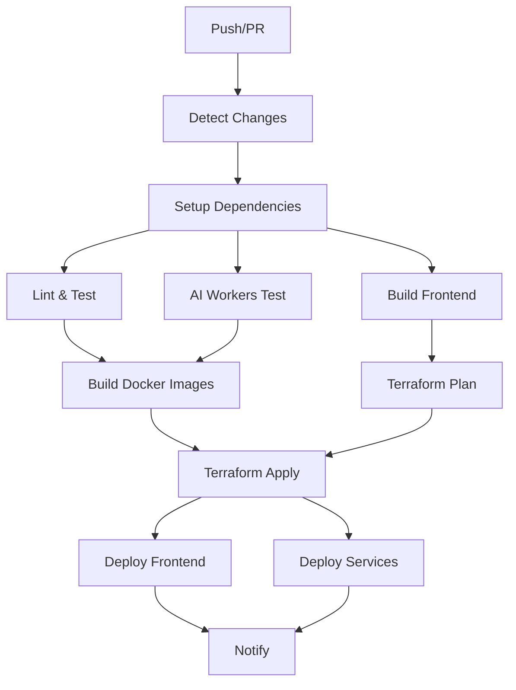

# GitHub Workflows & CI/CD Pipeline

This document explains all GitHub workflows, CI/CD processes, and automation in the TikTok Commerce Link Hub project.

## 📋 Table of Contents

- [Overview](#overview)
- [Main CI/CD Pipeline](#main-cicd-pipeline)
- [Workflow Triggers](#workflow-triggers)
- [Pipeline Stages](#pipeline-stages)
- [Environment Variables & Secrets](#environment-variables--secrets)
- [Branch Protection Rules](#branch-protection-rules)
- [Deployment Process](#deployment-process)
- [Troubleshooting](#troubleshooting)

## 🔄 Overview

Our CI/CD pipeline is designed for a **monorepo architecture** with multiple applications and services. It uses **GitHub Actions** to automate:

- **Code Quality**: Linting, formatting, type checking
- **Testing**: Unit, integration, and E2E tests
- **Building**: Docker images and application bundles
- **Infrastructure**: Terraform planning and deployment
- **Deployment**: Automated deployment to AWS

## 🚀 Main CI/CD Pipeline

**File**: `.github/workflows/ci-cd.yml`

### Workflow Structure



## 🎯 Workflow Triggers

### Automatic Triggers
```yaml
on:
  push:
    branches: [main, develop]
  pull_request:
    branches: [main, develop]
```

### Manual Triggers
- **Repository Dispatch**: For external integrations
- **Workflow Dispatch**: Manual execution from GitHub UI

## 🔍 Pipeline Stages

### 1. Change Detection
**Job**: `changes`
- **Purpose**: Detect which parts of the codebase changed
- **Technology**: `dorny/paths-filter@v2`
- **Outputs**: Boolean flags for each component

```yaml
outputs:
  frontend: ${{ steps.changes.outputs.frontend }}
  ingestion-api: ${{ steps.changes.outputs.ingestion-api }}
  product-service: ${{ steps.changes.outputs.product-service }}
  ai-workers: ${{ steps.changes.outputs.ai-workers }}
  libs: ${{ steps.changes.outputs.libs }}
  infra: ${{ steps.changes.outputs.infra }}
```

### 2. Setup & Dependencies
**Job**: `setup`
- **Purpose**: Install dependencies and build shared libraries
- **Conditions**: Runs if libs, frontend, or backend services changed
- **Caching**: Uses GitHub Actions cache for `node_modules` and build artifacts

### 3. Code Quality & Testing
**Job**: `lint-and-test`
- **Linting**: ESLint for TypeScript/JavaScript
- **Type Checking**: TypeScript compiler
- **Testing**: Jest for unit tests
- **Coverage**: Codecov integration

### 4. AI Workers Testing
**Job**: `ai-workers-test`
- **Matrix Strategy**: Tests each AI worker separately
- **Python Setup**: Python 3.11 with pip dependencies
- **Testing**: pytest with coverage reporting

### 5. Frontend Build
**Job**: `build-frontend`
- **Build Tool**: Vite
- **Output**: Static assets for deployment
- **Artifacts**: Uploaded for deployment stage

### 6. Docker Image Building
**Job**: `build-docker`
- **Condition**: Only on `main` branch
- **Services**: NestJS microservices
- **Registry**: Amazon ECR
- **Tags**: Both commit SHA and `latest`

### 7. AI Workers Docker Build
**Job**: `build-ai-workers`
- **Condition**: Only on `main` branch
- **Workers**: Python Lambda functions
- **Registry**: Amazon ECR
- **Base Image**: AWS Lambda Python runtime

### 8. Infrastructure Planning
**Job**: `terraform-plan`
- **Tool**: Terraform 1.5.0
- **Environment**: Development configuration
- **Output**: Terraform plan artifact

### 9. Infrastructure Deployment
**Job**: `terraform-apply`
- **Condition**: Only on `main` branch after successful builds
- **Environment**: Production (requires approval)
- **Input**: Terraform plan from previous stage

### 10. Frontend Deployment
**Job**: `deploy-frontend`
- **Target**: S3 + CloudFront
- **Process**: Sync to S3, invalidate CloudFront cache
- **Condition**: Only on `main` branch

### 11. Notifications
**Job**: `notify`
- **Slack Integration**: Deployment status notifications
- **Condition**: Always runs on `main` branch
- **Status**: Success/failure reporting

## 🔐 Environment Variables & Secrets

### Required Secrets
Configure these in GitHub repository settings:

#### AWS Credentials
```
AWS_ACCESS_KEY_ID=your-access-key
AWS_SECRET_ACCESS_KEY=your-secret-key
AWS_ACCOUNT_ID=123456789012
```

#### Application Secrets
```
OPENAI_API_KEY=your-openai-key
WHATSAPP_ACCESS_TOKEN=your-whatsapp-token
```

#### Deployment Targets
```
FRONTEND_S3_BUCKET=your-frontend-bucket
CLOUDFRONT_DISTRIBUTION_ID=your-distribution-id
```

#### Notifications
```
SLACK_WEBHOOK=your-slack-webhook-url
```

### Environment Variables
```yaml
env:
  AWS_REGION: us-east-1
  ECR_REGISTRY: ${{ secrets.AWS_ACCOUNT_ID }}.dkr.ecr.us-east-1.amazonaws.com
  NODE_VERSION: '18'
  PYTHON_VERSION: '3.11'
```

## 🛡️ Branch Protection Rules

### Main Branch Protection
- **Require pull request reviews**: 1 reviewer minimum
- **Require status checks**: All CI jobs must pass
- **Require branches to be up to date**: Enforce latest changes
- **Restrict pushes**: Only allow through pull requests

### Develop Branch Protection
- **Require status checks**: Lint and test jobs must pass
- **Allow force pushes**: For development flexibility

## 🚀 Deployment Process

### Development Deployment
1. **Trigger**: Push to `develop` branch
2. **Process**: 
   - Run tests and quality checks
   - Build Docker images (tagged with branch name)
   - Deploy to development environment
   - Run smoke tests

### Staging Deployment
1. **Trigger**: Create release branch or tag
2. **Process**:
   - Full test suite execution
   - Build production-ready images
   - Deploy to staging environment
   - Run full E2E test suite

### Production Deployment
1. **Trigger**: Push to `main` branch
2. **Process**:
   - All quality gates must pass
   - Manual approval required
   - Blue-green deployment strategy
   - Health checks and rollback capability

## 🔧 Workflow Configuration

### Matrix Strategies
```yaml
strategy:
  matrix:
    service: [ingestion-api, product-service, whatsapp-service]
    worker: [caption-parser, thumbnail-generator]
```

### Conditional Execution
```yaml
if: needs.changes.outputs.frontend == 'true'
if: github.ref == 'refs/heads/main'
if: always() && github.ref == 'refs/heads/main'
```

### Artifact Management
```yaml
- name: Upload build artifacts
  uses: actions/upload-artifact@v3
  with:
    name: frontend-build
    path: apps/frontend/dist

- name: Download build artifacts
  uses: actions/download-artifact@v3
  with:
    name: frontend-build
    path: dist
```

## 🐛 Troubleshooting

### Common Issues

#### 1. Build Failures
**Symptoms**: Docker build fails, dependency issues
**Solutions**:
- Check dependency versions in `package.json`
- Verify Docker base images are available
- Review build logs for specific errors

#### 2. Test Failures
**Symptoms**: Tests fail in CI but pass locally
**Solutions**:
- Check environment differences
- Verify test data and mocks
- Review timing issues in async tests

#### 3. Deployment Failures
**Symptoms**: Terraform apply fails, AWS resource errors
**Solutions**:
- Check AWS credentials and permissions
- Verify Terraform state consistency
- Review AWS service limits and quotas

#### 4. Cache Issues
**Symptoms**: Builds are slow, dependencies not cached
**Solutions**:
- Check cache key patterns
- Verify cache restore steps
- Clear cache if corrupted

### Debugging Commands

#### View Workflow Runs
```bash
gh run list --workflow=ci-cd.yml
gh run view <run-id>
```

#### Download Artifacts
```bash
gh run download <run-id>
```

#### Check Secrets
```bash
gh secret list
gh secret set SECRET_NAME --body "value"
```

## 📊 Monitoring & Metrics

### Workflow Metrics
- **Build Duration**: Track build time trends
- **Success Rate**: Monitor failure rates
- **Deployment Frequency**: Track deployment cadence

### Alerts
- **Failed Deployments**: Immediate Slack notifications
- **Long Build Times**: Alert if builds exceed thresholds
- **Security Issues**: Dependency vulnerability alerts

## 🔄 Workflow Optimization

### Performance Improvements
1. **Parallel Execution**: Run independent jobs concurrently
2. **Smart Caching**: Cache dependencies and build artifacts
3. **Conditional Builds**: Only build changed components
4. **Matrix Strategies**: Test multiple configurations efficiently

### Cost Optimization
1. **Efficient Resource Usage**: Right-size runners
2. **Cache Strategy**: Reduce redundant downloads
3. **Conditional Execution**: Skip unnecessary jobs
4. **Cleanup**: Remove old artifacts and images

## 📚 Additional Resources

- [GitHub Actions Documentation](https://docs.github.com/en/actions)
- [Docker Best Practices](https://docs.docker.com/develop/dev-best-practices/)
- [Terraform CI/CD](https://learn.hashicorp.com/tutorials/terraform/github-actions)
- [AWS ECR Documentation](https://docs.aws.amazon.com/ecr/)

---

**Next**: [AWS Production Deployment Guide](../deployment/aws-production.md)
